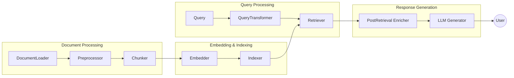

# RAG-Zoo

[](LICENSE)
---

## Table of Contents

1. [Overview](#overview)
2. [Key Features and Design Philosophy](#key-features-and-design-philosophy)
3. [Architecture and Core Concepts](#architecture-and-core-concepts)
4. [Installation and Setup](#installation-and-setup)
5. [Quick Start Guide](#quick-start-guide)
6. [Repository Structure](#repository-structure)
7. [Component Wise Guide](#component-wise-guide)
8. [Module-by-Module Deep Dive](#module-by-module-deep-dive)
9. [Links & Further Reading](#links-and-further-reading)

## Overview

**RAG-Zoo** is a robust and highly modular Python framework created by the Programming Club at IIT Kanpur to simplify the development, experimentation, and deployment of diverse Retrieval-Augmented Generation (RAG) pipelines. Designed to serve both as a cutting-edge research sandbox and a production-ready toolkit, RAG-Zoo empowers researchers, developers, and practitioners to design, swap, test, and optimize RAG components with minimal boilerplate and maximum flexibility.
Traditional RAG workflows often suffer from rigid, tightly coupled pipelines that make experimentation difficult and innovation slow. RAG-Zoo solves this by decomposing the entire RAG stack into clear, interchangeable stages such as chunking, embedding, indexing, retrieving, and generating, each governed by well-defined abstract base classes. Its plugin-based architecture, dependency injection, and comprehensive registry system enable developers to plug in custom or third-party modules seamlessly.
This approach transforms RAG development into an open-ended, modular process: you can mix and match different chunkers, embedders, vector stores, retrievers, and LLMs or even add your own without rewriting your entire pipeline. Combined with thorough testing suites, CI/CD support, and an easy-to-launch demo app, RAG-Zoo is built to accelerate both research prototypes and real-world RAG applications.

## Key Features and Design Philosophy

- Plug-and-Play Architecture:
    * The entire RAG pipeline is fully modular. Each stage — chunkers, embedders, vector stores, retrievers, generators — is implemented as an independent, swappable component. This makes it easy to mix and match implementations or add your own with just a few lines of code.
- Seamless Multi-Backend Support:
    * Effortlessly integrate with multiple LLM providers and embedding services including OpenAI, Groq, Ollama, Google Gemini, HuggingFace models, or even local deployments — all with consistent interfaces.
- Vector Store Agnostic:
    * Works out of the box with popular vector storage backends such as FAISS, ChromaDB, and Weaviate. You can also plug in your own custom indexer with minimal effort.
- Batteries-Included Demo:
    * Comes with a ready-to-use Streamlit demo app that showcases typical RAG flows. Perfect for quick experimentation, showcasing, or team onboarding.
- Diverse Pipeline Variants:
    * Includes pre-built pipelines like RunRAG (standard), AdaptiveRAG (dynamic index routing), GraphRAG (knowledge-graph enriched), CRAG (Corrective RAG with self-checking), and ReliableRAG (uncertainty-aware).
- Production-Grade Design:
    * Built for real-world deployment. The framework includes robust testing suites, CI/CD workflows, caching, and performance optimizations.
- Extensible Plugin Registry:
    * A simple yet powerful registry system lets you register and load custom modules on the fly, without modifying the core codebase.
- Strong Abstractions and Interfaces:
    * Clear abstract base classes for every stage ensure that new implementations stay consistent and easy to integrate.
- Flexible Query Transformers:
    * Support for query rewriting, decomposition, multi-query generation, and hybrid retrieval strategies to boost recall and answer quality.
- Comprehensive Evaluators:
    * Includes built-in evaluators for relevance scoring, segment attribution, and self-correction, making it easy to test and benchmark pipelines.
- Developer-Friendly Tooling:
    * Detailed documentation, modular repo layout, and example notebooks accelerate onboarding for contributors and researchers alike.


## Architecture and Core Concepts

### High-Level Architecture and Repository Layout

#### Repository Structure

```
RAG-Zoo/
├── rag_src/                    # core package
│   ├── Complete_RAG_Pipeline/  # pipelines
│   ├── chunker/                # text splitting
│   ├── embedder/               # embedding back-ends
│   ├── indexer/                # vector stores
│   ├── retriever/              # retrieval strategies
│   ├── llm/                    # LLM adapters
│   ├── ...
├── tests/                      # pytest suites
├── docs/                       # documentation site
├── examples/                   # demos & notebooks
├── pyproject.toml              # Poetry config
└── README.md
```

RAG-Zoo decomposes the end-to-end RAG workflow into six stages (chunking, embedding, indexing, retrieving, enriching and generating), each with an abstract base class and multiple implementations:



### Component Architecture

| Stage | Purpose | Default Implementation |
|-------|---------|----------------------|
| **1. Load** |Load and parse documents from various sources | `DefaultDocLoader` |
| **2. Preprocess** |  Clean and normalize documents | `DefaultPreprocessor` |
| **3. Chunk** | Split documents into manageable windows | `DefaultChunker` |
| **4. Embed** | Convert text chunks to dense vectors | `DefaultEmbedder` |
| **5. Index** | Persist and search embeddings efficiently | `DefaultIndexer` (FAISS) |
| **6. Retrieve** | Select top-K relevant chunks for queries | `DefaultRetriever` |
| **7. Query Tranformer** |  Rerank, compress, or rewrite contexts | `DefaultQueryTransformer` |
| **8. Generate** | Produce final natural language answers | `DefaultLLM` |

Pipelines **do not** create their own dependencies; instead, they receive ready-made objects.

## Installation and Setup

### Basic Installation

**TO DO**

### Environment Setup

**TO DO**

## Quick Start Guide

### Your First RAG Pipeline!

This sets up a default linear pipeline: documents are automatically loaded, chunked, embedded, indexed, and retrieved.  
Then an LLM generates an answer based on the top results.

```python
from rag_src.Complete_RAG_Pipeline import RunRAG
from rag_src.embedder import OpenAIEmbedder
from rag_src.retriever import HybridRetriever
from rag_src.llm import OllamaLLM

pipeline = RunRAG(docdir = "./docs_pdf",
  embedder = OpenAIEmbedder(),
  retriever = HybridRetriever(),
  llm = OllamaLLM()
)

answer = pipeline.run("What is the main topic of these documents?")
print(answer)
```

### Swap ANY Module!

One core idea of this package is modularity and ability to change and test specific components of our choice. 

eg:
```python
from rag_src.doc_loader import UniversalDocLoader
from rag_src.doc_preprocessor import AdvancedPreprocessor
from rag_src.chunker import SemanticChunker
from rag_src.embedder import GeminiEmbedder

# Load & preprocess documents
loader = UniversalDocLoader(path = "./docs_txt")
loaded_docs = loader.load()

preprocessed_docs = AdvancedPreprocessor().preprocess(loaded_docs)

# Chunk text
chunker = SemanticChunker(chunk_size = 300)
chunks = chunker.chunk(preprocessed_docs)

# Embed using Gemini
embedder = GeminiEmbedder()
embeddings = embedder.embed(chunks)

print(f"First embedding: {embeddings[0]}")
```
You can use your OWN COMBINATION - any chunker, any embedder, any vectorstore, etc.

### Injecting Metadata and Context enrichment

Here’s how to attach metadata and apply post-retrieval reranking.

```python
from rag_src.pre_embedding_enricher import MetadataInjector
from rag_src.post_retrival_enricher import SelfRerank
from rag_src.llm import OpenAILLM

# Add metadata tags to docs
metadata = {0: {"title": "My Document Title", "author": "Alice"}}
enricher = MetadataInjector(metadata)
docs = enricher.enrich(loaded_docs) # load your docs before enriching it

# After retrieval, rerank top results
reranker = SelfRerank(llm=OpenAILLM())
reranked_docs = reranker.enrich(docs)

print(reranked_docs)
```

### Improving your Queries with our Query Transformation Module

Query Transformers boost your pipeline’s relevance by rewriting, decomposing, or expanding queries.

eg:

```python
from rag_src.query_transformer import QueryDecomposer, MultiQuery
from rag_src.llm import OpenAILLM

# Decompose a complex query into simpler parts
decomposer = QueryDecomposer(llm=OpenAILLM())
sub_queries = decomposer.transform("Explain the pros and cons of quantum computing")
print(sub_queries)

# Or generate multiple rephrasings for robust retrieval
multi = MultiQuery(llm=OpenAILLM())
alt_queries = multi.transform("How does quantum computing work?", n=3)
print(alt_queries)
```

### Evaluators - check how grounded your answers are with your source

Our evaluator modules equip you with the tools to evaluate how relevant the generated response is to the original query using the provided contexts.

eg:

```python
from rag_src.evaluator import RelevanceEvaluator, SegmentAttributor
from rag_src.llm import OpenAILLM

query = "What is quantum computing?"
response = "Quantum computing uses qubits to..."
contexts = ["Quantum computing is based on qubits...", "Second context..."]

# Relevance check
evaluator = RelevanceEvaluator(llm=OpenAILLM())
result = evaluator.evaluate(query, response, contexts)
print(result)

# Find which document segments support the answer
segmenter = SegmentAttributor(llm=OpenAILLM())
segments = segmenter.locate_segments(query, response, contexts)
print(segments)
```
---


## Component Wise Guide

In this we'll see examples on using certain components and get a rough idea of what the component does

### Data Preparation

We will be looking at the components related to preparing data to get raw data ready for the system.

Our [doc_loader](#doc_loader) , [doc_preprocessor](#doc_preprocessor) , [chunker](#chunker) and [pre_embedding_enricher](#pre_embedding_enricher) modules help us accomplish this.

```python
from rag_src.doc_loader import UniversalDocLoader, UncommonDocLoader
from rag_src.doc_preprocessor import AdvancedPreprocessor

universal_loader = UniversalDocLoader(path="./sample.txt")
common_docs = universal_loader.load()

uncommon_loader = UncommonDocLoader(path="./products.csv")
uncommon_docs = uncommon_loader.load()

all_docs = common_docs + uncommon_docs
print(f"Got {len(all_docs)} docs.")

# Preprocessing all docs
preprocessor = AdvancedPreprocessor(remove_stopwords=True)
processed_docs = preprocessor.preprocess(all_docs)

print("Sample doc - ")
print(processed_docs[0])
```
```python
from rag_src.pre_embedding_enricher import QAPairGenerator
from rag_src.llm import OpenAILLM

qa_generator = QAPairGenerator(llm=OpenAILLM())
qa_docs = qa_generator.enrich(processed_docs)
print("\n--- Enriched with QA Pairs ---")
print(qa_docs[0])
```
```python
from rag_src.chunker import RecursiveChunker

final_docs = qa_docs

chunker = RecursiveChunker()
chunks = chunker.chunk(final_docs)
print(f"Created {len(chunks)} chunks using RecursiveChunker.")
```

---

### Embedding And Indexing

Next we'll see how about seeing how our modules help us go about embedding and indexing

Our [embedder](#embedder) and [indexer](#indexer) modules help us here

```python
from rag_src.embedder import OpenAIEmbedder

embedder = OpenAIEmbedder(model_name = "text-embedding-3-small") 
embeddings = embedder.embed(texts=chunks)

print(f"Generated {len(embeddings)} embeddings.")
```
```python
from rag_src.indexer import ChromaDBIndexer

indexer = ChromaDBIndexer(collection_name="rag_documents", persist_directory="./chroma_index")
indexer.index(embeddings=embeddings, documents=chunks)
indexer.persist()

print(f"Successfully indexed {len(chunks)} chunks in ChromaDB.")
```

---

### Query Transformer

In case of RAG techniques having good queries can make our results MUCH BETTER. That's exactly what the [query_transformer](#query_transformer) module does

```python
from rag_src.query_transformer import LLMWebQueryTransformer
from rag_src.llm import OpenAILLM

llm = OpenAILLM()

web_transformer = LLMWebQueryTransformer(llm = llm)
web_search_query = web_transformer.transform("What were the latest advancements in AI in 2024?")
print("\nWeb Search Optimized Query - ")
print(web_search_query[0])
```

---

### Retrieval

So this is us getting the necessary data from the pipeline to be fed into the LLM as extra context. We use the [retriever](#retriever) and [web_retriever](#web_retriever) modules here for the same.

```python
    from rag_src.web_retriever import DuckDuckGoWebRetriever

    query = "What is Retrieval-Augmented Generation?"

    retriever = DuckDuckGoWebRetriever(max_results=5)
    results = retriever.retrieve(query)
    text = "\n\n".join(textnode.text for textnode in results)

    print("DuckDuckGo Web Results")
    print(text)
```
```python
from rag_src.retriever import ReRankingRetriever

query = "What are the components of a RAG system?"
reranking_retriever = ReRankingRetriever(
    index_path="./chroma_index",
    initial_top_n=20
)
reranked_docs = reranking_retriever.retrieve(query, k=5)
print("Showing reranked docs-")
for doc in reranked_docs:
    print(f"Text:\n{doc['text']}\n")
```

----

### Generation

The final stage where the LLM uses the retrieved documents to generate an answer. We'll see about using the [post_retrieval_enricher](#post_retrieval_enricher) and [llm](#llm) modules here.

```python
from rag_src.post_retrieval_enricher import DocSummarizer
from rag_src.llm import OpenAILLM, GroqLLM

retrieved_texts = [doc['text'] for doc in reranked_docs]
query = "What are the components of a RAG system?"
llm = OpenAILLM()
groq_llm = GroqLLM(model="llama3-8b-8192")

summarizer = DocSummarizer(llm=llm)
summarized_docs = summarizer.enrich(retrieved_texts)
print("Summarized Context:")
print(summarized_docs[0], end="\n\n")

response = groq_llm.generate(query=query, contexts=summarized_docs)
print("Final Generated Answer: ")
print(response)
```

---

### Evaluation

The single component dedicated to measuring the system's effectiveness - [evaluator](#evaluator)

```python
from rag_src.evaluator import RelevanceEvaluator
from rag_src.llm import OpenAILLM

query = "What are the components of a RAG system?"
response = "A RAG system has three main components: a data preparation pipeline, a retrieval mechanism, and a generation model." #Example

eval_llm = OpenAILLM()
relevance_evaluator = RelevanceEvaluator(llm=eval_llm, threshold=0.7)
relevance_data = relevance_evaluator.evaluate(
    query=query,
    response=response,
    contexts=contexts
)

print("Relevance Evaluation- ")
print(f"Relevance Score: {relevance_data['relevance_score']}")
print(f"Above Threshold?: {relevance_data['above_threshold']}")
```
----

### Advanced RAG Techniques Available as complete pipelines

Ability to incorporate advanced rag techniques in programs with minimal lines of code is amazing isn't it? We can do that we the [Complete_RAG_Pipeline](#complete_rag_pipeline) modules


#### AdaptiveRAG

```python
from rag_src.Complete_RAG_Pipeline import AdaptiveRAG
from rag_src.llm import OpenAILLM
from rag_src.embedder import OpenAIEmbedder
llm = OpenAILLM(model="gpt-4")
embedder = OpenAIEmbedder(model_name="text-embedding-3-small")

adaptive_rag = AdaptiveRAG(
    llm=llm,
    embeddor=embedder,
    docdir="./documents"
)

response = adaptive_rag.run("What are different perspectives on AI ethics?")
print(f"Adaptive RAG Response: {response}")
```

#### GraphRAG

```python
from rag_src.Complete_RAG_Pipeline import GraphRAG
from rag_src.llm import SmartLLM
from rag_src.embedder import OpenAIEmbedder

llm = SmartLLM()
embedder = OpenAIEmbedder(model_name="text-embedding-3-small")
graph_rag = GraphRAG(
    llm=llm,
    embedder=embedder,
    docdir="./documents"
)
response = graph_rag.run("What is the relationship between quantum computing and cryptography?")
print(f"Graph RAG Response: {response}")

graph_rag.visualize_graph(output_file="knowledge_graph.html")
```

#### CRAG

```python
from rag_src.Complete_RAG_Pipeline import CRAG
from rag_src.llm import OpenAILLM
from rag_src.embedder import OpenAIEmbedder
from rag_src.web_retriever import TavilyWebRetriever

llm = OpenAILLM(model="gpt-4")
embedder = OpenAIEmbedder(model_name="text-embedding-3-small")
web_retriever = TavilyWebRetriever(api_key="your_tavily_api_key")
crag = CRAG(
    llm=llm,
    embeddor=embedder,
    web_retriever=web_retriever,
    docdir="./documents"
)
response = crag.run("What are the latest quantum computing breakthroughs in 2024?")
print(f"CRAG Response: {response}")
```

#### ReliableRAG

```python
from rag_src.Complete_RAG_Pipeline import ReliableRAG
from rag_src.llm import OpenAILLM
from rag_src.embedder import OpenAIEmbedder

llm = OpenAILLM(model="gpt-4")
embedder = OpenAIEmbedder(model_name="text-embedding-3-small")
reliable_rag = ReliableRAG(
    llm=llm,
    embeddor=embedder,
    docdir="./documents"
)

response = reliable_rag.run("Explain the principles of quantum entanglement")
print(f"Reliable RAG Response: {response}")
```
------

## Module-by-Module Deep Dive

### Complete_RAG_Pipeline

|Class | Info |
|-------|------------|
| `RunRAG` | Default linear pipeline (load → embed → index → retrieve → generate) |
|`AdaptiveRAG` | Multi-index routing via query classifier |
|`GraphRAG` | Knowledge-graph enrichment + Pyvis visualization |
| `CRAG` | Corrective RAG with self-evaluation & web fallback |
|`ReliableRAG` | Confidence scoring + uncertainty quantification |

---

### doc_loader/

- `UncommonDocLoader` - doc loader for uncommon document formats: .epub, .csv, .json, .xml, .rst, .tex
    * __init__(self, path: Union[str, Path], encoding: str = "utf-8")
    * load(self) -> List[str]
    * _load_epub(self, path: Path) -> str
    * _load_csv(self, path: Path) -> str
    * _load_json(self, path: Path) -> str
    * _load_xml(self, path: Path) -> str
    * _load_plaintext(self, path: Path) -> str
- `UniversalDocLoader` - universal document loader supporting .txt, .md, .pdf, .docx, .html
    * __init__(self, path: Union[str, Path], encoding: str = "utf-8")
    * load(self) -> List[str]
    * _load_txt(self, path: Path) -> str
    * _load_pdf(self, path: Path) -> str
    * _load_docx(self, path: Path) -> str
    * _load_html(self, path: Path) -> str
---
### doc_preprocessor/

- `AdvancedPreprocessor` -  Advanced preprocessor that performs lowercasing, stripping blank space, unicode normalization, HTML tag removal, special character cleanup
    * __init__(self, remove_stopwords: bool = False, language: str = "english")
    * preprocess(self, docs: List[str]) -> List[str]
---
### query_transformer/

- `QueryDecomposer` - breaks down a complex user query into simpler sub-questions
    * __init__(self, llm, verbose: bool = False)
    * transform(self, query: str) -> List[str]
- `HyDe` - does HyDE
    * __init__(self, llm, include_original: bool = True)
    * transform(self, query: str) -> List[str]
- `MultiQuery` - generates multiple reformulated queries from the original input query
    * __init__(self, llm)
    * transform(self, query: str, n: int = 5) -> List[str]
- `LLMWebQueryTransformer` - transforms a user query into a more web-search-optimized version using an LLM.
    *  __init__(self, llm: BaseLLM)
    * transform(self, query: str) -> List[str]
---
### evaluator/
---
- `RelevanceEvaluator` - evaluates how relevant the generated response is to the original query using the provided contexts.
    * __init__(self, llm: BaseLLM, threshold: float = 0.7)
    * evaluate(
        self,
        query: str,
        response: str,
        contexts: List[str]
    ) -> Dict[str, Any]
- `SegmentAttributor` - identifies exact segments from documents that support the generated answer
    *  __init__(self, llm)
    * locate_segments(
        self,
        query: str,
        response: str,
        docs: List[TextNode]
    ) -> List[Dict[str, Any]]
    *  evaluate(
        self,
        query: str,
        response: str,
        contexts: List[str]
    ) -> Dict[str, Any]
---
### chunker/

- `RecursiveChunker` – hierarchical separators, overlap preserved  
    *  __init__(self, chunk_size: int = 512, chunk_overlap: int = 50)
    * chunk(
        self,
        docs: List[str],
        metadata: Optional[List[Dict[str, str]]] = None
    ) -> List[str]
- `SemanticChunker` – sentence-transformer similarity boundaries
    * __init__(self, chunk_size: int = 512, chunk_overlap: int = 50)
    * chunk(
        self,
        docs: List[str],
        metadata: Optional[List[Dict[str, str]]] = None
    ) -> List[str]
- `TokenChunker` – divides input texts into chunks with configurable overlaps
    * __init__(self, chunk_size: int = 512, chunk_overlap: int = 50)
    * chunk(self, docs: List[str], metadata: Optional[List[Dict[str, str]]] = None) -> List[str]
---
### embedder/

- `OpenAIEmbedder` – 1 536-D or 3 072-D via /v1/embeddings 
    * __init__(self, model_name: str = "text-embedding-3-small", api_key: str = None)
    * embed(
        self,
        texts: List[str],
        mode: Literal["query", "document"] = "document"
    ) -> List[List[float]]
- `GeminiEmbedder` – Google GenAI multimodal embeddings
    * __init__(self, model_name: str = "models/embedding-001", api_key: str = None)
    * embed(
        self,
        texts: List[str],
        mode: Literal["query", "document"] = "document"
    ) -> List[List[float]]
---
### indexer/

- `ChromaDBIndexer` – DuckDB-backed, metadata queries
    * __init__(
        self,
        collection_name: str = "rag_documents",
        persist_directory: str = "./chroma_index"
    )
    * index(
        self,
        embeddings: List[List[float]],
        documents: List[str],
        metadata: Optional[List[Dict[str, Any]]] = None
    ) -> None
    * reset(self) -> None
    * persist(self) -> None
- `WeaviateIndexer` – cloud HNSW, schema enforcement
    * __init__(
        self,
        weaviate_url: str,
        api_key: Optional[str] = None,
        class_name: str = "DocumentChunk",
        recreate_schema: bool = True
    )
    * index(
        self,
        embeddings: List[List[float]],
        documents: List[str],
        metadata: Optional[List[Dict[str, Any]]] = None
    ) -> None
    * reset(self) -> None
    * persist(self) -> None
  - `FAISS` is the default indexer
---
### retriever/

- `FusionRetriever` - retrieves and gives a combined set of top documents from multiple retrieval methods or query variants.
    * __init__(self, retriever: BaseRetriever, top_k: int = 5)
    * expand_query(self, query: str) -> List[str]
    * retrieve(self, query: str) -> List[Dict[str, Any]]
- `ReRankingRetriever` - retrieves and gives top k documents
    * __init__(self, index_path = "default_index", model_name = "all-MiniLM-L6-v2", reranker_model_name="BAAI/bge-reranker-large",
initial_top_n:int = 20)
    * rerank(self, query: str, docs:List[Dict[str, Any]], k:int =5) -> List[Dict[str, Any]]
    * retrieve(self, query:str, k:int =5) -> List[Dict[str, Any]]:
- `NeighborhoodContextRetriever` – graph-aware context expansion
    *  __init__(self, base_retriever: BaseRetriever, all_documents: List[Dict[str, Any]], num_neighbors: int = 1, chunk_overlap: int = 20)
    * retrieve(self, query: str) -> List[Dict[str, Any]]  
- `ExplainableRetriever` – retrieves and gives token-limited text chunks from documents, optionally enriched with metadata.
    * __init__(self, retriever: BaseRetriever, top_k: int = 5)
    * generate_explanation(self, query: str, document: str) -> str
    * retrieve(self, query: str) -> List[Dict[str, Any]]
---
### llm/

- `SmartLLM` - GraphRAG LLM
    * __init__(self)
    * generate(self, query: str, contexts: List[str]) -> str
  
  Lot more functios under this can be seen under graph_Rag_llm.py in llm folder

- `HuggingFaceLLMWrapper` -  HuggingFace LLM
    * __init__(self, model_name: str = "distilbert")
    * generate(self, query: str, contexts: List[str], temperature: float = 0.7) -> str
- `OpenAILLM` – GPT-3.5-Turbo / GPT-4 / GPT-4o
    *  __init__(self, model: str = "gpt-4")
    * generate(self, query: str, contexts: List[str]) -> Union[str, dict] 
- `GroqLLM` – ultra-low latency Mixtral/Gemma 
    *  __init__(self, api_key: str = None, model: str = "llama3-8b-8192" )
    * generate(self, query: str, contexts: List[str]) -> Union[str, dict]
- `OllamaLLM` – local Llama 3, Mistral  
    * __init__(self, model: str = "mistral")
    * generate(self, query: str, contexts: List[str]) -> Union[str, dict]
- `GeminiLLM` – Google Gemini Pro / Flash
    * __init__(self, api_key: str = None, model: str = "gemini-1.5-flash")
    * generate(self, query: str, contexts: List[str]) -> Union[str, dict]
---
### web_retriever/

- `DuckDuckGoWebRetriever` - Retrieves stuff via DuckDuckGo
    * __init__(self, max_results: int = 5)
    * retrieve(self, query: str) -> List[TextNode]
- `SerpAPIWebRetriever` - Retrieves stuff via SerpAPI
    * __init__(self, api_key: str = None, max_results: int = 5)
    * retrieve(self, query: str) -> List[TextNode]
- `TavilyWebRetriever` - Retrieves stuff via TavilyAPI
    *  __init__(self, api_key: str = None, max_results: int = 5)
    * retrieve(self, query: str) -> List[TextNode]
- `HybridWebRetriever` - Attempts retrieval via a combination of the above three
    * __init__(
        self, tavily: Optional[BaseWebRetriever] = None, serpapi: Optional[BaseWebRetriever] = None, duckduckgo: Optional[BaseWebRetriever] = None, max_results: int = 5,
    )
    * _deduplicate(self, nodes: List[TextNode]) -> List[TextNode]
    * retrieve(self, query: str) -> List[TextNode]
---
### pre_embedding_enricher/

- `MetadataInjector` - Adds metadata (like title, author, timestamp) to each document. Metadata is provided as a dictionary indexed by document position
    * __init__(self, metadata: dict)
    * enrich(self, docs: List[str]) -> List[str]
- `QAPairGenerator` - Converts documents into question–answer pairs using an LLM. Helpful for improving grounding and context awareness
    * __init__(self, llm)
    * enrich(self, docs: List[str]) -> List[str]
- `TopicTagger` - Uses the LLM to classify each document's topic.Appends the topic as a tag to the beginning of each doc.
    * __init__(self, llm)
    * enrich(self, docs: List[str]) -> List[str]
---
### post_retrieval_enricher
- `DocSummarizer` - It helps reduce the size and the noise in the retrieved context.
    * __init__(self, llm)
    * enrich(self, docs: List[str]) -> List[str]
- `SelfRerank` - This class re-ranks the documents using the LLM
    * __init__(self, llm, top_k: int = 5)
    * enrich(self, docs: List[str]) -> List[str]
- `SemanticFilter` - Filters out documents that are semantically dissimilar to the query using cosine similarity of embeddings.
    * __init__(self, embedder, query_embedding, threshold: float = 0.75)
    * enrich(self, docs: List[str]) -> List[str]


## Links and Further Reading
* [GitHub][1]

---

[1]: https://github.com/pclubiitk/RAG-Zoo
