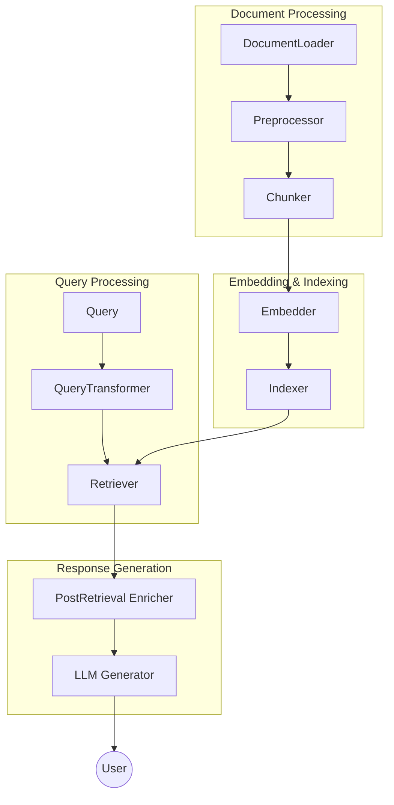

# High Level overview of the Architecture

RAG-Zoo decomposes the end-to-end RAG workflow into six stages (chunking, embedding, indexing, retrieving, enriching and generating), each with an abstract base class and multiple implementations:

# Component Architecture

| Stage | Purpose | Default Implementation |
|-------|---------|----------------------|
| **1. Load** |Load and parse documents from various sources | `DefaultDocLoader` |
| **2. Preprocess** |  Clean and normalize documents | `DefaultPreprocessor` |
| **3. Chunk** | Split documents into manageable windows | `DefaultChunker` |
| **4. Embed** | Convert text chunks to dense vectors | `DefaultEmbedder` |
| **5. Index** | Persist and search embeddings efficiently | `DefaultIndexer` (FAISS) |
| **6. Retrieve** | Select top-K relevant chunks for queries | `DefaultRetriever` |
| **7. Query Tranformer** |  Rerank, compress, or rewrite contexts | `DefaultQueryTransformer` |
| **8. Generate** | Produce final natural language answers | `DefaultLLM` |

Pipelines **do not** create their own dependencies; instead, they receive ready-made objects.
