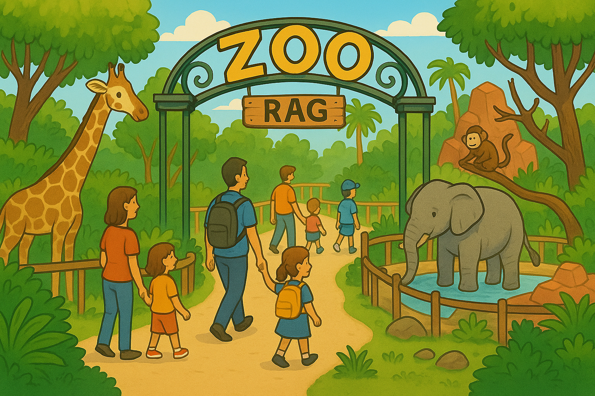

# RAG Zoo Documentation

## **Overview**

**RAG-Zoo** is a robust and highly modular Python framework created by the Programming Club at IIT Kanpur to simplify the development, experimentation, and deployment of diverse Retrieval-Augmented Generation (RAG) pipelines. Designed to serve both as a cutting-edge research sandbox and a production-ready toolkit, RAG-Zoo empowers researchers, developers, and practitioners to design, swap, test, and optimize RAG components with minimal boilerplate and maximum flexibility.
Traditional RAG workflows often suffer from rigid, tightly coupled pipelines that make experimentation difficult and innovation slow. RAG-Zoo solves this by decomposing the entire RAG stack into clear, interchangeable stages such as chunking, embedding, indexing, retrieving, and generating, each governed by well-defined abstract base classes. Its plugin-based architecture, dependency injection, and comprehensive registry system enable developers to plug in custom or third-party modules seamlessly.
This approach transforms RAG development into an open-ended, modular process: you can mix and match different chunkers, embedders, vector stores, retrievers, and LLMs or even add your own without rewriting your entire pipeline. Combined with thorough testing suites, CI/CD support, and an easy-to-launch demo app, RAG-Zoo is built to accelerate both research prototypes and real-world RAG applications.

## **Key Features and Design Philosophy**

- Plug-and-Play Architecture:
  - The entire RAG pipeline is fully modular. Each stage — chunkers, embedders, vector stores, retrievers, generators — is implemented as an independent, swappable component. This makes it easy to mix and match implementations or add your own with just a few lines of code.
- Seamless Multi-Backend Support:
  - Effortlessly integrate with multiple LLM providers and embedding services including OpenAI, Groq, Ollama, Google Gemini, HuggingFace models, or even local deployments — all with consistent interfaces.
- Vector Store Agnostic:
  - Works out of the box with popular vector storage backends such as FAISS, ChromaDB, and Weaviate. You can also plug in your own custom indexer with minimal effort.
- Batteries-Included Demo:
  - Comes with a ready-to-use Streamlit demo app that showcases typical RAG flows. Perfect for quick experimentation, showcasing, or team onboarding.
- Diverse Pipeline Variants:
  - Includes pre-built pipelines like RunRAG (standard), AdaptiveRAG (dynamic index routing), GraphRAG (knowledge-graph enriched), CRAG (Corrective RAG with self-checking), and ReliableRAG (uncertainty-aware).
- Production-Grade Design:
  - Built for real-world deployment. The framework includes robust testing suites, CI/CD workflows, caching, and performance optimizations.
- Extensible Plugin Registry:
  - A simple yet powerful registry system lets you register and load custom modules on the fly, without modifying the core codebase.
- Strong Abstractions and Interfaces:
  - Clear abstract base classes for every stage ensure that new implementations stay consistent and easy to integrate.
- Flexible Query Transformers:
  - Support for query rewriting, decomposition, multi-query generation, and hybrid retrieval strategies to boost recall and answer quality.
- Comprehensive Evaluators:
  - Includes built-in evaluators for relevance scoring, segment attribution, and self-correction, making it easy to test and benchmark pipelines.
- Developer-Friendly Tooling:
  - Detailed documentation, modular repo layout, and example notebooks accelerate onboarding for contributors and researchers alike.

## Links and Further Reading

- [GitHub](https://github.com/pclubiitk/RAG-Zoo)

---
